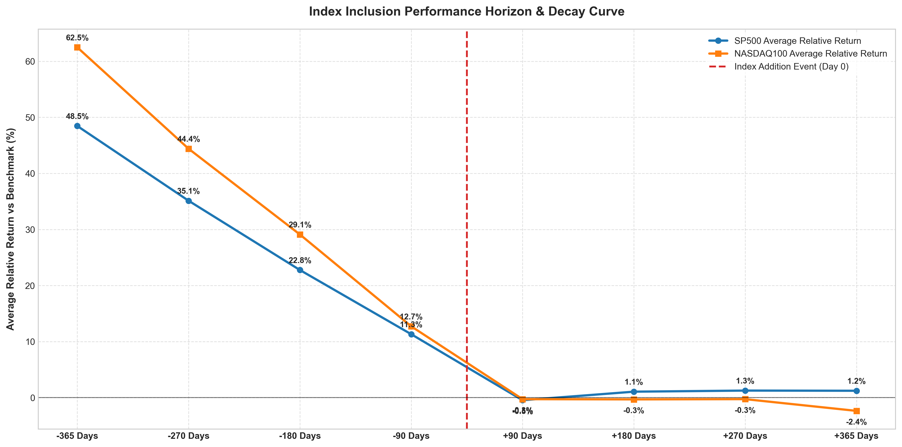

# Index Inclusion Effect: 4-Quarter Decay Analysis

A quantitative study on how the "Index Inclusion Effect" behaves and decays over a **4-quarter horizon** (90, 180, 270, and 365 calendar days) before and after stocks are added to the S&P 500 and NASDAQ-100. We measure absolute returns and relative returns against the benchmark indices (`^GSPC` and `^NDX`) over matching calendar windows.

---

## 1. Executive Summary

> [!IMPORTANT]
> **The Index Inclusion Effect exhibits a dramatic post-inclusion decay**:
> - **Pre-Addition Momentum**: Stocks added to both indices are massive winners in the year leading up to their addition. Over 365 days pre-addition, S&P 500 inclusions outperform the index by an average of **+48.45%** (81.4% win rate), and NASDAQ-100 inclusions outperform by **+62.48%** (79.4% win rate).
> - **Post-Addition Decay**: Once added, the outperformance completely stops and decays.
>   - **S&P 500**: Over the 365 days post-addition, the average relative return is +1.23%, but the median relative return is **-2.23%** and the win rate is only **45.5%** (most stocks underperform).
>   - **NASDAQ-100**: The decay is extremely severe. Over the 365 days post-addition, the average relative return decays to **-2.36%**, the median relative return decays to **-10.51%**, and the win rate drops to only **35.8%** (nearly two-thirds of all added stocks underperform).

---

## 2. Multi-Horizon Performance Summary

### A. S&P 500 Inclusions (N ≈ 410 Events)
| Horizon (Days) | Pre-Addition Avg. Rel. Return | Pre-Addition Win Rate | Post-Addition Avg. Rel. Return | Post-Addition Median Rel. Return | Post-Addition Win Rate |
| :--- | :---: | :---: | :---: | :---: | :---: |
| **90 Days (1 Qtr)** | +11.31% | 69.3% | -0.46% | -0.71% | 48.2% |
| **180 Days (2 Qtrs)** | +22.76% | 76.5% | +1.07% | -2.35% | 45.3% |
| **270 Days (3 Qtrs)** | +35.12% | 78.6% | +1.26% | -1.52% | 46.5% |
| **365 Days (4 Qtrs)** | +48.45% | 81.4% | +1.23% | -2.23% | 45.5% |

### B. NASDAQ-100 Inclusions (N ≈ 140 Events)
| Horizon (Days) | Pre-Addition Avg. Rel. Return | Pre-Addition Win Rate | Post-Addition Avg. Rel. Return | Post-Addition Median Rel. Return | Post-Addition Win Rate |
| :--- | :---: | :---: | :---: | :---: | :---: |
| **90 Days (1 Qtr)** | +12.72% | 66.7% | -0.27% | -2.01% | 42.6% |
| **180 Days (2 Qtrs)** | +29.10% | 75.9% | -0.31% | -2.70% | 43.9% |
| **270 Days (3 Qtrs)** | +44.39% | 77.3% | -0.27% | -7.74% | 41.2% |
| **365 Days (4 Qtrs)** | +62.48% | 79.4% | -2.36% | -10.51% | 35.8% |

---

## 3. Inclusion Performance Horizon & Decay Chart

- **Detailed Event-by-Event CSV Data**: [index_additions_analysis.csv](file:///Users/sjamthe/Documents/GithubRepos/EfficientFrontier/SP500/index_additions_analysis.csv)
- **Chart**: [index_inclusion_comparison.png](./SP500/index_inclusion_comparison.png)

---

## 4. Key Takeaways

1. **The NASDAQ-100 Hangover**: The post-inclusion decay is much more severe for NASDAQ-100 additions than for S&P 500 additions. One year after being added, the median NASDAQ-100 addition underperforms the index by **10.51%** with only a **35.8% chance** of beating the index. This suggests that the high valuation multiples and speculative hype that often accompany additions to the NASDAQ-100 (which is tech-heavy and lacks S&P's strict profitability requirements) lead to severe post-inclusion valuation contraction.
2. **S&P 500 Quality Stabilization**: S&P 500 additions also underperform on a median basis (-2.23% relative return, 45.5% win rate), but their average post-addition relative return remains slightly positive (+1.23% over 365 days). This suggests that S&P's strict inclusion rules (which require positive cumulative earnings over the prior four quarters) filter for higher-quality companies that are better able to stabilize after the passive buying surge concludes.
3. **Strategic Investment Angle**: These findings suggest that buying stocks *in anticipation* of index inclusion is highly profitable (average relative returns of 11% to 12% in the 90 days prior), but *holding* them after they are added is a losing strategy compared to simply holding the index itself.
