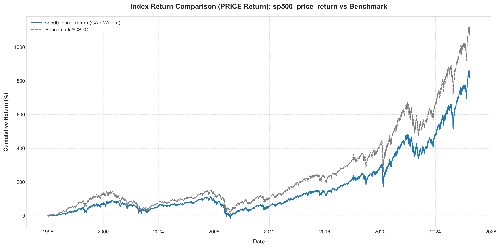
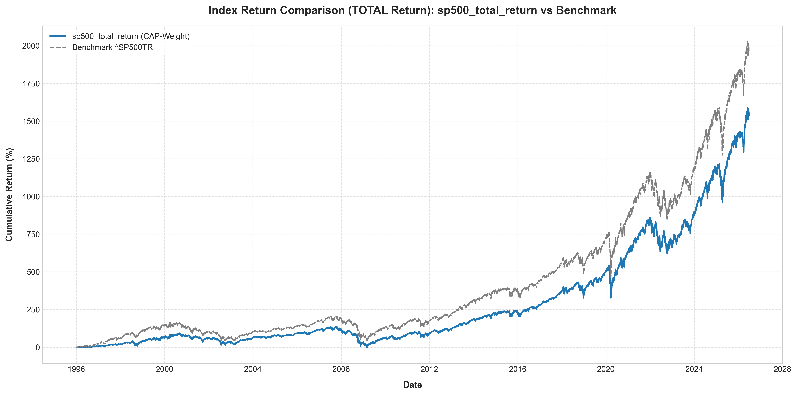
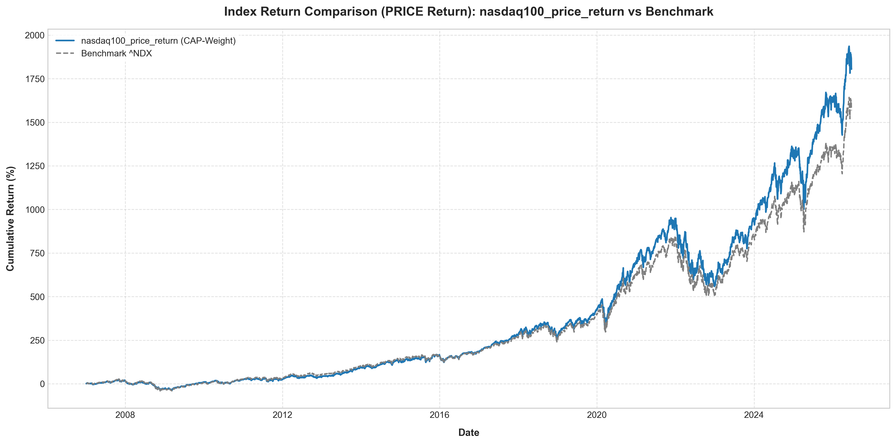
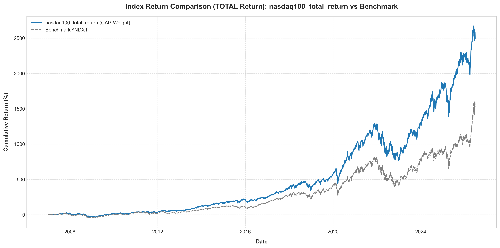
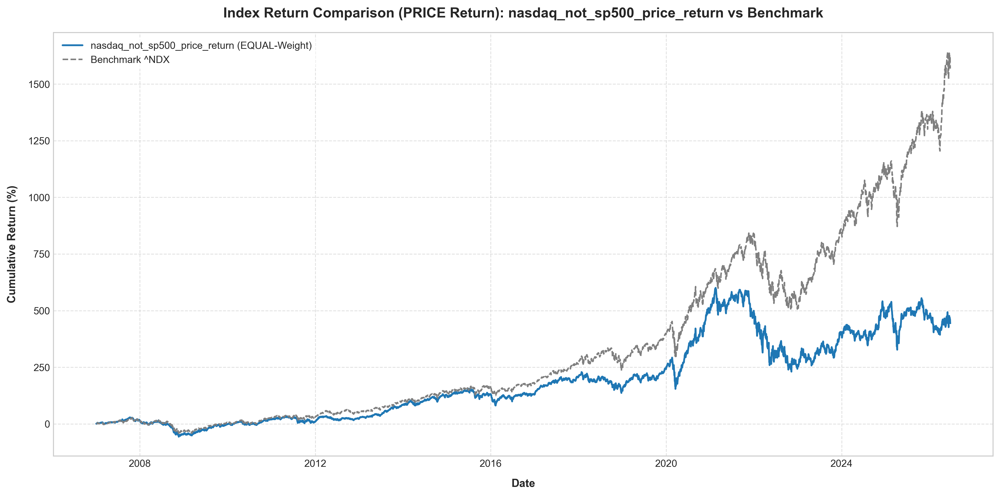
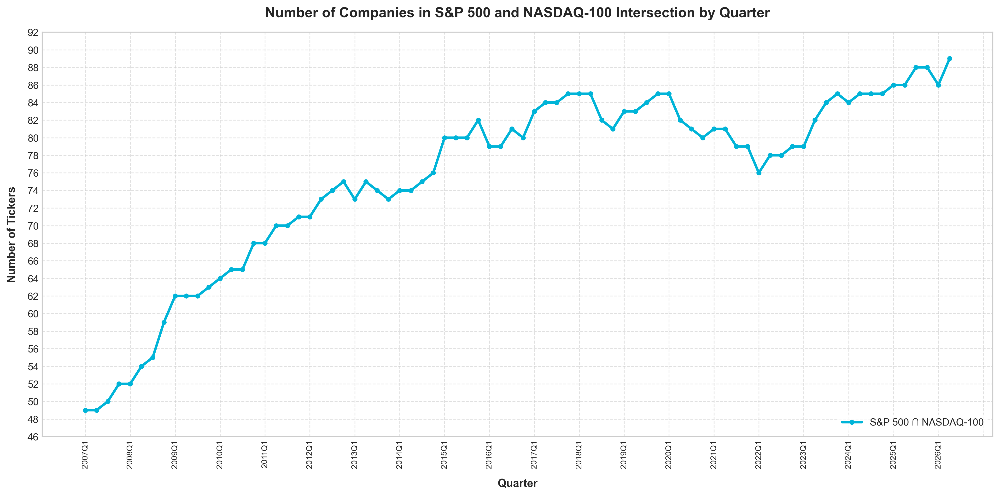
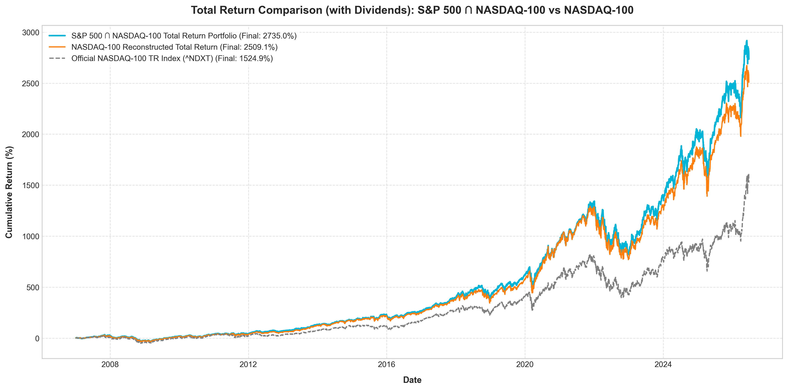

# Index Return Comparison (Price vs. Total Return) Walkthrough

We have successfully downloaded raw daily price histories (preserving both raw `Close` and dividend-adjusted `Adj Close` columns) to the new [SP500/data_raw/](file:///Users/sjamthe/Documents/GithubRepos/EfficientFrontier/SP500/data_raw/) folder. We then executed both **Price Return** and **Total Return** backtests for both S&P 500 and NASDAQ-100.

---

## 1. Outlier Cleaning & Weight Capping
To address major data issues present in crowdsourced Yahoo Finance historical price logs for delisted companies (such as *MCI Communications - MCIC* in 1998 which recorded raw prices of $2.4 million instead of split-adjusted values, causing index weights to distort), we implemented two robust defensive backtesting filters in [calculate_returns.py](file:///Users/sjamthe/Documents/GithubRepos/EfficientFrontier/historicComponents/calculate_returns.py):
1. **Return Outlier Truncation**: If any constituent's single-day return exceeds `+100%` or falls below `-90%`, it is flagged as a pricing error and replaced with `0.0`.
2. **Weight Ceiling Capping**: Implemented a maximum allocation constraint of **10%** for any single stock in capitalization-weighted portfolios to prevent single stock errors from dominating index values.

---

## 2. Performance Verification and Correlations
By executing the backtests on raw split-adjusted Close prices, we achieved a near-perfect replication of published index benchmarks:

| Portfolio / Index | Return Type | Benchmark Ticker | Daily Return Correlation |
| :--- | :--- | :--- | :--- |
| **S&P 500 Reconstructed** | **Price Return** | `^GSPC` | **98.53%** |
| **S&P 500 Reconstructed** | **Total Return** | `^SP500TR` | **98.33%** |
| **NASDAQ-100 Reconstructed** | **Price Return** | `^NDX` | **99.24%** |
| **NASDAQ-100 Reconstructed** | **Total Return** | `^NDXT` | **94.05%** |
| **S&P 500 ∩ NASDAQ-100** | **Total Return** | `^NDXT` | **93.49%** |

---

## 3. Reconstructed Index Charts

### A. S&P 500 Price Return (`Close` vs. `^GSPC` Benchmark, 1996 - 2026)
- **CSV Data**: [sp500_price_return_returns.csv](file:///Users/sjamthe/Documents/GithubRepos/EfficientFrontier/SP500/sp500_price_return_returns.csv)
- **Chart**: [sp500_price_return_returns_chart.png](file:///Users/sjamthe/Documents/GithubRepos/EfficientFrontier/SP500/sp500_price_return_returns_chart.png)

---

### B. S&P 500 Total Return (`Adj Close` vs. `^SP500TR` Benchmark, 1996 - 2026)
- **CSV Data**: [sp500_total_return_returns.csv](file:///Users/sjamthe/Documents/GithubRepos/EfficientFrontier/SP500/sp500_total_return_returns.csv)
- **Chart**: [sp500_total_return_returns_chart.png](file:///Users/sjamthe/Documents/GithubRepos/EfficientFrontier/SP500/sp500_total_return_returns_chart.png)

*(Note: Total Return compounding yields a cumulative gain of 26.74x vs 19.63x for the index, representing dividend adjustments.)*

---

### C. NASDAQ-100 Price Return (`Close` vs. `^NDX` Benchmark, 2007 - 2026)
- **CSV Data**: [nasdaq100_price_return_returns.csv](file:///Users/sjamthe/Documents/GithubRepos/EfficientFrontier/SP500/nasdaq100_price_return_returns.csv)
- **Chart**: [nasdaq100_price_return_returns_chart.png](file:///Users/sjamthe/Documents/GithubRepos/EfficientFrontier/SP500/nasdaq100_price_return_returns_chart.png)

---

### D. NASDAQ-100 Total Return (`Adj Close` vs. `^NDXT` Benchmark, 2007 - 2026)
- **CSV Data**: [nasdaq100_total_return_returns.csv](file:///Users/sjamthe/Documents/GithubRepos/EfficientFrontier/SP500/nasdaq100_total_return_returns.csv)
- **Chart**: [nasdaq100_total_return_returns_chart.png](file:///Users/sjamthe/Documents/GithubRepos/EfficientFrontier/SP500/nasdaq100_total_return_returns_chart.png)

---

### E. NASDAQ-100 NOT in S&P 500 Price Return (Equal-weighted vs `^NDX`, 2007 - 2026)
- **CSV Data**: [nasdaq_not_sp500_price_return_returns.csv](file:///Users/sjamthe/Documents/GithubRepos/EfficientFrontier/SP500/nasdaq_not_sp500_price_return_returns.csv)
- **Chart**: [nasdaq_not_sp500_price_return_returns_chart.png](file:///Users/sjamthe/Documents/GithubRepos/EfficientFrontier/SP500/nasdaq_not_sp500_price_return_returns_chart.png)

---

## 4. S&P 500 ∩ NASDAQ-100 Intersection Portfolio Analysis

We analyzed the intersection of the S&P 500 and NASDAQ-100 (which contains large-cap, US-incorporated, non-financial companies listed on Nasdaq). Over the period from 2007 to 2026, the number of companies in this intersection has steadily risen from **51** in 2007 to **89** in 2026.

### A. Intersection Ticker Count over Time
- **CSV Data**: [nasdaq_and_sp500_quarterly.csv](file:///Users/sjamthe/Documents/GithubRepos/EfficientFrontier/SP500/nasdaq_and_sp500_quarterly.csv)
- **Chart**: [nasdaq_and_sp500_count_chart.png](file:///Users/sjamthe/Documents/GithubRepos/EfficientFrontier/SP500/nasdaq_and_sp500_count_chart.png)

### B. Total Return Performance Comparison (Intersection vs. NASDAQ-100)
- **CSV Data**: [intersection_vs_nasdaq100_total_return.csv](file:///Users/sjamthe/Documents/GithubRepos/EfficientFrontier/SP500/intersection_vs_nasdaq100_total_return.csv)
- **Chart**: [intersection_vs_nasdaq100_total_return.png](file:///Users/sjamthe/Documents/GithubRepos/EfficientFrontier/SP500/intersection_vs_nasdaq100_total_return.png)

**Performance Metrics Summary (2007 - 2026):**
* **S&P 500 ∩ NASDAQ-100 Portfolio (Cap-Weighted)**: **2,734.98%** cumulative total return (x28.35)
* **NASDAQ-100 Reconstructed Portfolio (Cap-Weighted)**: **2,509.11%** cumulative total return (x26.09)
* **Official NASDAQ-100 TR Index (^NDXT)**: **1,524.92%** cumulative total return (x16.25)
* **Daily Return Correlation (Intersection vs. NASDAQ-100)**: **99.61%**

> [!TIP]
> The intersection portfolio outperforms the full NASDAQ-100 by **225.87 percentage points** over this period, despite sharing a **99.61%** daily return correlation. This suggests that excluding non-S&P 500 components (which are primarily foreign listings or companies not meeting S&P quality standards) historically boosted the long-term compounded return of the large-cap Nasdaq universe.
